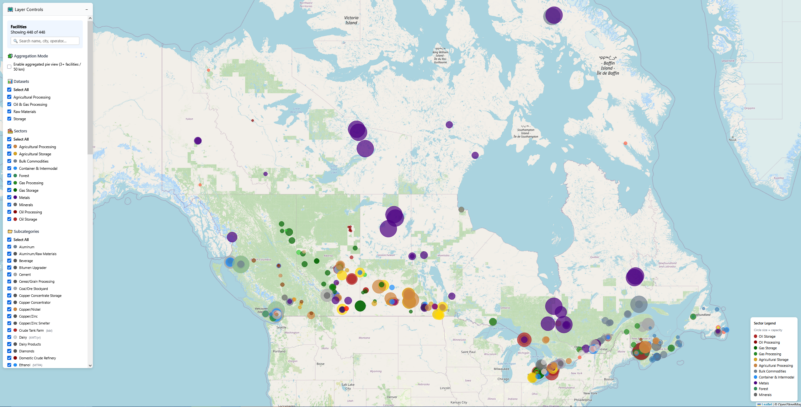

# 🇨🇦 Canada Industrial & Infrastructure Map

An interactive, **fully client-side** visualization of Canadian industrial capacity and national infrastructure — facilities, power generation, pipelines, ports, weather, hydrology, land use, and live aircraft/vessel tracking — all on one Leaflet map.

> **Live demo:** [https://sam10155.github.io/Map-Data-Visualization/](https://sam10155.github.io/Map-Data-Visualization/)



---

## 📊 What's on the map

### Facilities (~1,400 editable points)

| Dataset | Count | Examples |
|---|---|---|
| **Storage** | ~325 | Crude tank farms, refined-product terminals, gas/LNG/NGL storage, grain elevators, fertilizer/feed terminals, bulk-commodity stockyards, container & intermodal terminals |
| **Oil & Gas Processing** | ~97 | Refineries, upgraders, petrochemical plants, gas plants, NGL fractionators, LNG liquefaction, renewable-fuel projects |
| **Raw Materials** | ~219 | Steel mills, aluminum smelters, base-metal smelters/refineries, gold/diamond/uranium mills, pulp & paper, sawmills, cement/lime/salt/potash |
| **Agricultural Processing** | ~221 | Canola/soy crush, fertilizer plants, ethanol, meat/poultry, dairy, flour/sugar, beverages, seafood |
| **Power Generation** | ~556 | Hydro, nuclear, gas, coal, wind, solar, battery, biomass — plus **221 transmission lines / interties** (CER/operator-verified 2026-08; incl. under-construction & proposed, rendered dashed) |

Every facility carries `status` (Active / Idle / Closed / Under Construction / Proposed) and most carry a `notes` field with verification commentary. All records have been multi-agent fact-checked for operator, location, capacity and operating status; see [`REVIEW_REPORT.md`](REVIEW_REPORT.md) for the full audit trail.

### Overlay layers (toggle from the right-hand mode bar)

| Layer | Source | Notes |
|---|---|---|
| 🌦️ **Weather** | [Open-Meteo](https://open-meteo.com) | Temperature grid, wind arrows, precipitation, ⚡ thunderstorms. Sub-toggles per variable; **↻ Fit view** refits the grid to your zoom level. National grid on mount, zero API calls on pan/zoom. |
| 💧 **Water Systems** | StatCan drainage regions + OSM + ECCC/DFO/ORRPB/HQ/QC | Official drainage-basin polygons (incl. separate Island-of-Newfoundland section), **54k Canada-clipped river segments**, and a **Water levels** sub-layer: ~2,900 live station markers classified very-low→very-high against per-station HYDAT monthly percentile bands, 36 major reservoirs with estimated **capacity/fill %** (gold ring), coastal tide gauges, 24-h level sparkline on click. Refreshed every 6 h by GitHub Action. |
| 🔥 **Wildfires** | [NRCan CWFIS](https://cwfis.cfs.nrcan.gc.ca) + ECCC FireWork | Live active-fire markers (status-coloured, area-scaled), last-24 h satellite hotspots, **💨 surface-PM2.5 smoke forecast** (GeoMet WMS, current hour), optional fire-danger raster. Fetched client-side, refreshes hourly — no pre-baked data. |
| ⚓ **Ports & Airports** | curated | ~50 seaports + inland ports, ~60 airports (intl + regional). |
| 🌾 **Land Use** | [AAFC Annual Crop Inventory](https://agriculture.canada.ca/imagery-images/rest/services/annual_crop_inventory/) + NRCan Land Cover | 30 m, 75 crop classes (wheat/canola/corn/soy/lentils/potatoes/…). **Click anywhere** to identify the exact crop class. Radio-toggle to NRCan land-cover; opacity slider. |
| ⚡ **Power Generation** | curated + audit | Sub-toggles for **🔌 Power lines / 🏭 Generation**. Type-glyph badges over the editable facility circles, plus voltage-class-coloured transmission lines with **animated electron pulses**; unbuilt lines dashed. |
| 🛢️ **Pipelines** | curated (CER-checked) + StatCan | 50 crude/products/NGL/gas pipelines incl. under-construction LNG feeders; commodity-coloured, capacity-scaled, animated flow. **Storage-hub markers** (gold ring) aggregate tank-farm shell capacity per hub (Hardisty ~33 Mbbl…) with a monthly provincial StatCan crude-stocks gauge. |
| 📡 **Live Tracking** | airplanes.live · adsb.lol · adsb.fi · adsbdb · AISStream · GFW | ✈ Aircraft with **5 type-shaped icons** (GA / narrowbody / widebody / helicopter / military) and **dep→arr route** in tooltip. 🚢 AIS vessels (needs free key). 🐟 Fishing vessels via Global Fishing Watch (needs free token). Each independently toggleable. |

---

## 🌍 Core map features

- 🗺️ **Leaflet + OSM tiles** — pan/zoom, hover tooltips, capacity-scaled markers
- 🔘 **Status filter & styling** — Active (solid) / Idle (dashed) / Closed (faded) / Under Construction / Proposed; legend + filter checkboxes
- 🧩 **Aggregation pies** — cluster by 50 km, province, or region; metric = facilities / capacities / workers
- 🔎 **Search** — live filter by name, operator, city, province
- 🧮 **Hierarchical filters** — dataset → sector → subcategory, with select-all and unit hints
- ✏️ **Full editing** — move markers, edit any attribute (incl. status), create new, soft-delete; persists across reloads via File System Access API
- ↺ **Reset / ⬇️ Download Edits** — export your overrides as JSON for `scripts/merge_edits.py`
- 📋 **Table view** — sortable/filterable; click coords to jump back to map
- ⬇️ **CSV export** — visible facilities, includes status

---

## 📂 Repository structure

```
Map-Data-Visulization/
├── index.html
├── css/style.css
├── js/
│   ├── main.js  map.js  edit.js  filters.js  ui.js
│   ├── aggregate.js  metrics.js  search.js  download.js
│   ├── constants.js  tableview.js  mapmodes.js
│   └── layers/
│       ├── weather.js  water.js  transport.js  landuse.js
│       ├── power.js  pipelines.js  tracking.js  rail.js  wildfire.js
├── data/
│   ├── canada-data.js            # 862 industrial facilities (status/notes)
│   ├── canada-power.js           # 566 plants + 221 transmission lines
│   ├── canada-pipelines.js       # 50 pipelines (CER-checked 2026-08)
│   ├── canada-ports-airports.js
│   ├── canada-water-basins.js    # simplified basin fallback + named-river backbone
│   ├── canada-basins.geojson     # official StatCan drainage regions (1.2 MB)
│   ├── canada-boundary.geojson   # Natural Earth 50m Canada polygon (for clipping)
│   ├── canada-rivers.geojson     # 54k Canada-clipped OSM river segments (~11 MB)
│   ├── canada-rail.geojson       # pre-baked OSM rail corridors
│   ├── canada-water-levels.geojson  # live station levels — updated 6-hourly by Action
│   ├── canada-water-normals.json # HYDAT per-station monthly percentile bands
│   ├── canada-reservoirs.json    # curated reservoir constants (FSL/min/capacity)
│   ├── canada-crude-stocks.json  # StatCan provincial crude stocks — twice-monthly Action
│   └── config.js                 # generated from .env (API keys) — gitignored
├── scripts/
│   ├── gen_config.py             # .env → data/config.js
│   ├── apply_review.py           # apply verification-workflow findings
│   ├── append_gaps.py            # merge gap-analysis additions
│   ├── merge_power.py            # merge power-audit results
│   ├── fetch_rivers.py           # bake OSM rivers → canada-rivers.geojson
│   ├── trim_us_rivers.py         # polygon-clip rivers to Canada boundary
│   ├── fetch_basins.py           # fetch StatCan drainage regions → canada-basins.geojson
│   ├── fetch_rail.py             # bake OSM rail → canada-rail.geojson
│   ├── bake_water_normals.py     # HYDAT sqlite → percentile bands (quarterly)
│   ├── fetch_water_levels.py     # ECCC+DFO+ORRPB+HQ+QC+AB → water-levels geojson
│   ├── fetch_crude_stocks.py     # StatCan WDS → provincial crude stocks
│   ├── merge_edits.py            # apply downloaded user-edit JSON to source data
│   └── cloudflare-worker.js      # optional CORS proxy for GitHub Pages
├── serve.py                      # local dev server with /proxy/ passthrough
├── .github/workflows/
│   ├── deploy.yml                # GitHub Pages deploy (injects secrets)
│   ├── water-levels.yml          # cron 0 */6: fetch levels, commit, redeploy
│   └── crude-stocks.yml          # cron 1st+16th: StatCan stocks, commit, redeploy
├── REVIEW_REPORT.md              # full data-verification audit
└── README.md
```

---

## ⚙️ Local setup

```bash
git clone git@github.com:sam10155/Map-Data-Visulization.git
cd Map-Data-Visulization

# (optional) configure API keys for live tracking
cat > .env <<EOF
AISSTREAM_API_KEY=your_aisstream_key      # free: aisstream.io
GFW_API_TOKEN=your_gfw_jwt_token          # free: globalfishingwatch.org/our-apis
TRACKING_PROXY=/proxy/                    # use serve.py's built-in proxy locally
EOF
python3 scripts/gen_config.py             # writes data/config.js

# start the dev server (static files + CORS proxy on :8081)
python3 serve.py 8081
```

Open **http://localhost:8081/**.

`serve.py` adds a `/proxy/<host>/<path>` passthrough so aircraft feeds work even when upstream rate-limit responses lack CORS headers. The simpler `python3 -m http.server` also works but without the proxy.

### 🔑 Setting API keys from the browser console

Instead of the `.env` + `gen_config.py` route, you can set keys directly in the browser. Open the site, press <kbd>F12</kbd> → **Console**, paste the command for the service you have a key for, then reload the page. Keys persist in that browser via `localStorage` (per-site, so run them while on the map page).

**AISStream** — 🚢 live vessel positions (free key from [aisstream.io](https://aisstream.io)):

```js
localStorage.setItem('aisstream_key', 'YOUR_AISSTREAM_KEY')
```

**Global Fishing Watch** — 🐟 fishing-vessel events (free token from [globalfishingwatch.org/our-apis](https://globalfishingwatch.org/our-apis)):

```js
localStorage.setItem('gfw_token', 'YOUR_GFW_JWT_TOKEN')
```

The legend's `AIS API` health line polls the public [AISStream-Uptime](https://github.com/buttermilkgreen/AISStream-Uptime) service ([aisuptime.buttermilkgreen.fyi](https://aisuptime.buttermilkgreen.fyi)) automatically — no key or setup needed.

To verify what's currently set, or to remove a key:

```js
localStorage.getItem('aisstream_key')       // shows the stored key (null if unset)
localStorage.removeItem('aisstream_key')    // forget it
localStorage.removeItem('gfw_token')
```

Notes:
- Reload the page after setting or removing a key — they're read once on layer mount.
- AISStream allows **one concurrent connection per key**: a second tab (or anything else using the key) silently starves the first.
- Keys set this way stay on your machine, but they're plain text in DevTools → Application → Local Storage. Both services' keys are free and instantly rotatable, so treat leakage as an inconvenience, not an incident.
- Aircraft tracking needs **no key** — it uses open ADS-B feeds.

### Regenerating data

| Task | Command |
|---|---|
| Re-bake river geometry from OSM | `python3 scripts/fetch_rivers.py` (~30 min) then `python3 scripts/trim_us_rivers.py` (~3 min) |
| Refresh drainage-basin polygons | `python3 scripts/fetch_basins.py` |
| Re-bake HYDAT water-level normals (quarterly) | `python3 scripts/bake_water_normals.py` (downloads ~266 MB) |
| Fetch current water levels manually | `python3 scripts/fetch_water_levels.py` |
| Fetch StatCan crude stocks manually | `python3 scripts/fetch_crude_stocks.py` |
| Refresh `data/config.js` from `.env` | `python3 scripts/gen_config.py` |
| Apply a downloaded edits JSON | `python3 scripts/merge_edits.py edits.json` |

---

## 🚀 Deploying to GitHub Pages

The site is **100 % static** — every external feed used is either CORS-enabled, an image-tile service, a WebSocket, or pre-baked into `data/`.

**Settings → Pages → Source:** *GitHub Actions*, then choose one of:

### 🔒 Secure mode (recommended) — keys never reach the browser

1. Deploy the Cloudflare Worker (`scripts/cloudflare-worker.js` + `wrangler.toml`) and store your keys as **Worker secrets**:
   ```bash
   cd scripts && wrangler deploy
   wrangler secret put AISSTREAM_API_KEY
   wrangler secret put GFW_API_TOKEN
   wrangler secret put ALLOWED_ORIGINS   # optional: https://<you>.github.io
   ```
2. Add **one** repo secret: `TRACKING_PROXY` = `https://canada-map-viz.<account>.workers.dev/`
3. Push to `main`. The deploy workflow writes only the (public) worker URL into `config.js`; the browser connects to `wss://…/ais` and `…/gfw/events` and the worker injects the keys server-side.

Full walkthrough: [`docs/SECURE_DEPLOY.md`](docs/SECURE_DEPLOY.md).

### 🪪 Direct mode — keys embedded client-side

Skip the worker; set `AISSTREAM_API_KEY` + `GFW_API_TOKEN` as repo secrets. They'll be written into `data/config.js` and are **visible to any visitor via View Source**. Acceptable for these free, easily-rotated keys, but not actually secret.

### What works on Pages with no keys at all

Everything except 🚢 AIS ships and 🐟 GFW fishing. Aircraft, weather, water, land use, power, pipelines, ports/airports all work out of the box.

---

## 🧱 Data model

```js
{
  name: 'Trans Mountain Burnaby Tank Farm',
  operator: 'Trans Mountain',
  sector: 'Oil Storage',
  subcategory: 'Crude Tank Farm',
  province: 'BC',
  city: 'Burnaby',
  lat: 49.260, lon: -122.950,
  capacity: 5600000, unit: 'bbl',
  status: 'Active',                      // Active | Idle | Closed | Under Construction | Proposed
  notes: 'Capacity post-TMX expansion…'  // optional — verification commentary
}
```

Power plants follow the same shape with `sector:'Power Generation'`, `subcategory:'Hydro'|'Wind'|…`, `unit:'MW'`. Transmission lines and pipelines live in `data/canada-power.js` / `canada-pipelines.js` with `path:[[lat,lon],…]` waypoints.

---

## 🔌 External data sources

| Source | Used for | CORS / browser-OK |
|---|---|---|
| Open-Meteo | weather | ✅ |
| OpenStreetMap Overpass (`overpass-api.de`, `z.overpass-api.de`, `overpass.openstreetmap.fr`) | tributary streams (zoom ≥ 10) | ✅ |
| AAFC Annual Crop Inventory ImageServer | crop-type raster + identify | ✅ (image tiles) |
| NRCan / datacube.services.geo.ca | land-cover WMS | ✅ (image tiles) |
| airplanes.live · adsb.lol · adsb.fi | live aircraft positions | ✅ (sequential, ≤6 tiles) |
| adsbdb.com | flight dep/arr route lookup | ✅ |
| AISStream.io | live AIS vessel positions | ✅ (WebSocket) — free key |
| Global Fishing Watch v3 | recent fishing-vessel events | ✅ — free token |
| ECCC MSC GeoMet (`api.weather.gc.ca`) | hydrometric station history (click sparklines) | ✅ |
| NRCan CWFIS (`cwfis.cfs.nrcan.gc.ca` + `geoserver.cwfif.nrcan.gc.ca`) | live wildfires, hotspots, fire-danger WMS | ✅ |
| ECCC GeoMet (`geo.weather.gc.ca`) | FireWork smoke-plume PM2.5 WMS | ✅ (image tiles) |

---

## 🧰 Tech stack

- **Frontend:** vanilla HTML / CSS / JS — no build step, no framework
- **Mapping:** Leaflet 1.9 + OpenStreetMap tiles
- **Persistence:** File System Access API (OPFS) for local edits
- **Server:** `serve.py` (Python stdlib, `ThreadingHTTPServer`) — static + allow-listed CORS proxy
- **Hosting:** GitHub Pages via Actions

---

## 📜 License

**MIT © 2025–2026 Samuel Pacheco** — use, modify, and adapt freely with attribution.
